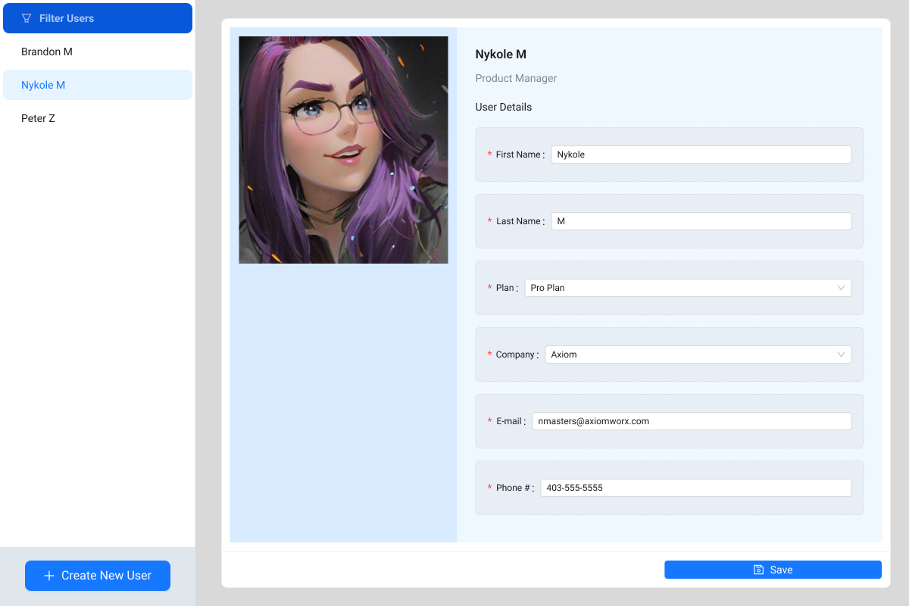
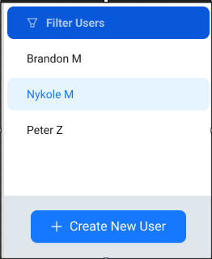
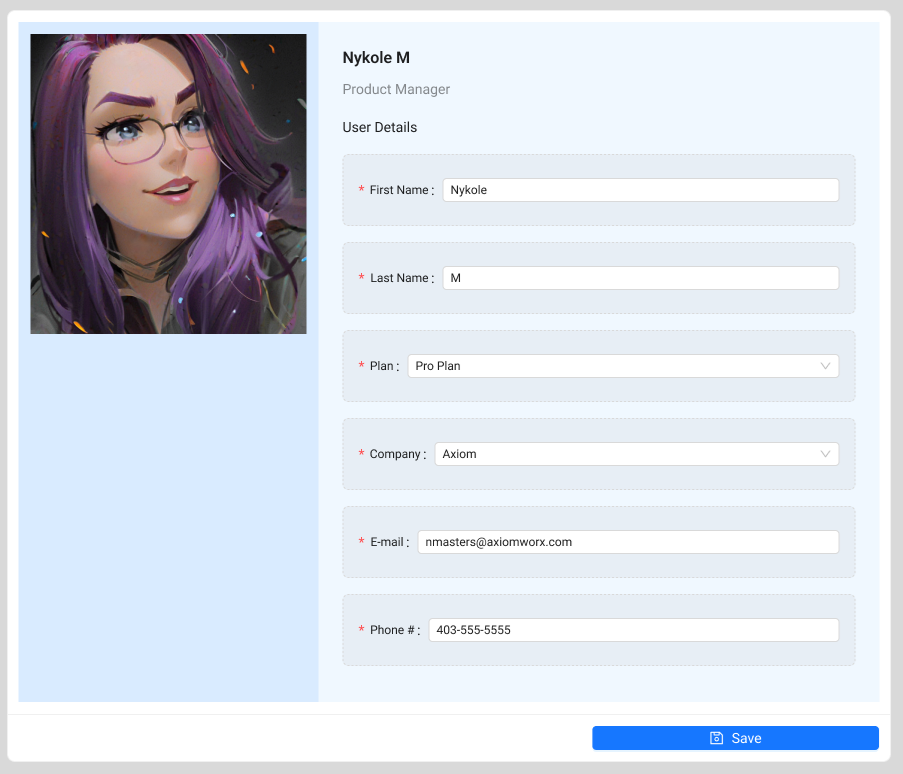
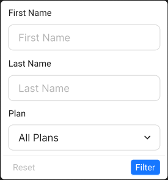
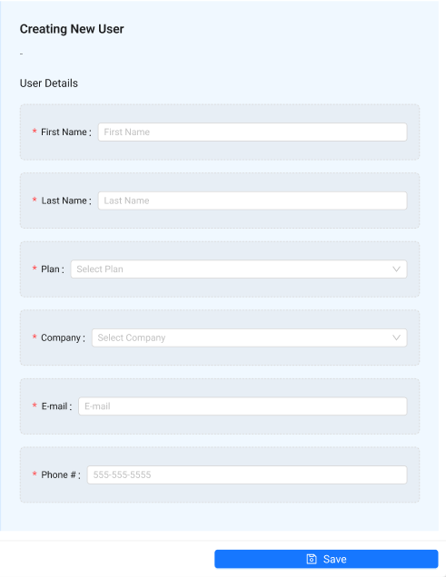

# Take Home Assessment - Front-End

This boiler plate project should help you get going on your take home assessment. It includes a basic install for vue and vite. 

It comes packaged with pinia for state management.

Read all instructions carefully before proceeding, and ensure your dev environment is up and running.

## Recommended IDE Setup

[VSCode](https://code.visualstudio.com/) + [Volar](https://marketplace.visualstudio.com/items?itemName=Vue.volar) (and disable Vetur).

## Project Setup 
### Install packages

```sh
yarn
```

### Compile and Hot-Reload for Development
```sh
yarn dev
```

### Compile and Minify for Production (Not required by assessment)
```sh
yarn build
```

### Lint with [ESLint](https://eslint.org/)
```sh
yarn lint
```

# Assessment Instructions

Create a simple front-end application based on the provided figma mock ups. 

- Your submission should be in the form of a Pull-Request.
- Deployment is optional, but encouraged.
- Data is provided via a pre-compiled REST API, provided to you in your email from HR.
- Commit messages should use [conventional commits](https://www.conventionalcommits.org/en/v1.0.0/)

### Endpoint Documentation
| Method | Endpoint |
| ----- | -----|
| GET | /users |
| GET (filter) | /users?First Name=value |
| GET (by id) | /users/1 |
| GET (paginate) | /users?_page=2&_limit=10
| POST | /users |
| PUT | /users/1 |
| PATCH | /users/1 |
| DELETE | /users/1 |

### The Application should:
- Show a filterable list of all users in the system.
- Show a detail display for a user when one is selected, where user info can be modified and saved.
- Show a modal for creating a new user
- Validate inputs before submitting forms

### Additional Notes:
- Use pinia for app state management.
- 3rd party UI libraries are allowed. Feel free to use one of your choice. UI does not need to match the mockup exactly.
- Add additional libraries as you wish.
- For Avatars, please use  [dicebear](https://www.dicebear.com/styles/pixel-art/).
- Unit tests are not *required* as part of this assessment.

# Mockups
## Outline
Your application should render a very basic list of users, and a detail pane showing user information. You should be able to modify existing users, and create new users.



## User List
The user list should show a filterable collection of user from the provided API.



### Users should be able to:
- Click an item in the list and see user details in the detail pane
- Click the filter and be able to filter the list by plan type.
- Click the "create new user" button and be presented with a modal for creating a new user

## Details Pane
The details pane shows the detail of an individual user.



### Users should be able to:
- View basic details about the current user
- Edit details for a user
- Validate inputs before saving
- Save the user

## Filter Panel
The filter panel is used for filtering the user list. It will contain a dropdown and a search box.



### Users should be able to:
- Select from a list of Plan Types
- Search by a string value
- /have the list filtered immediately

## Create User Modal
The create user modal is used for creating a new user and should include form validation.


### Users should be able to:
- See a modal dialog containing fields for creating a new user
- See a selector containing a list of Plans to choose from:
  - Free Plan
  - Basic Plan
  - Pro Plan
  - Enterprise Plan
- See a selector containing a list of Companies to choose from (Use a set of basic values):
  - Apple
  - Microsoft
  - Google
- Validate inputs before saving
- Click a save button to create the new user
- See the list updated immediately with the new user


